# Node and React Development Project

Welcome to our Node and React Development project ! In this documentation, we'll showcase various screenshots of our app to help you understand the purpose of each page.

## Home
The home page is simple, providing an overview of the project's goals.
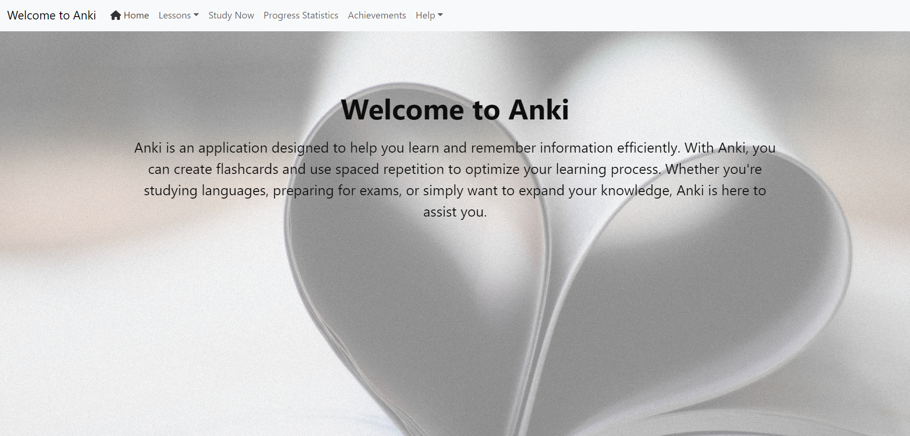

## Lessons/Import Lessons
Easily import new lessons to the website on this page. (! NOT WORKING !)
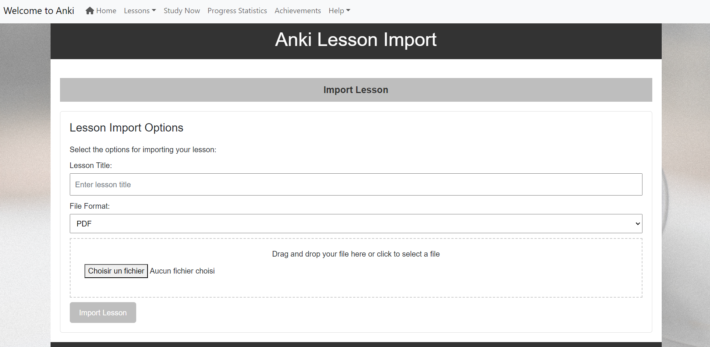

## Lessons/Explore Lessons
Quickly review and explore the lessons you've uploaded.
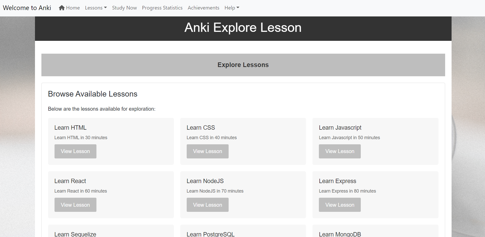

When clicking on a lesson, you can edit its informations. You can also see the facts that compose it, edit them, delete them, or add new ones.
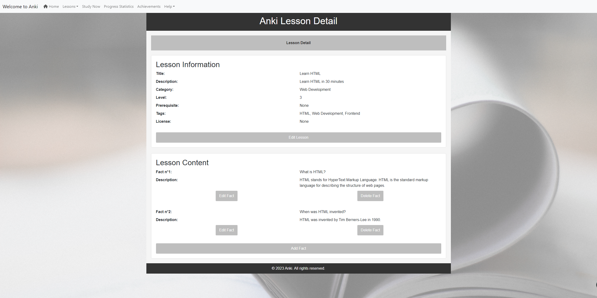

When editing a lesson:
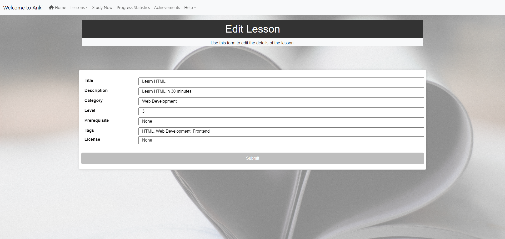

When editing a fact:
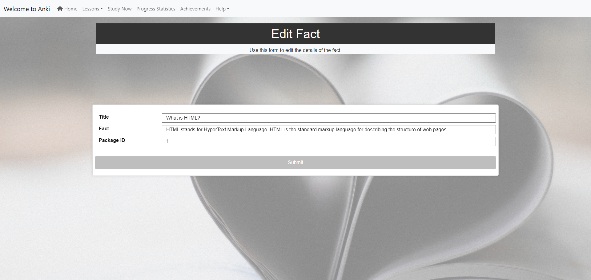

When adding a fact:
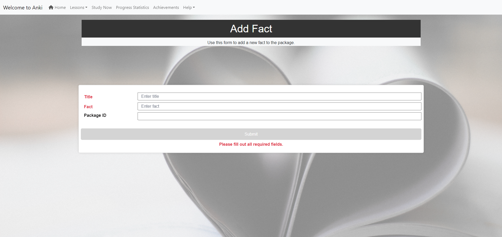

## Lessons/Export Lessons
Upload and store lessons on your computer in different formats such as pdf, docx, or txt.
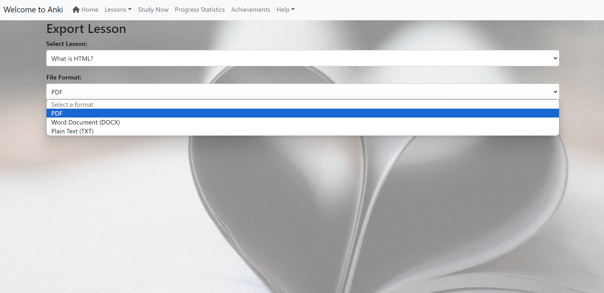

## Study Now
Access the core of the website, where you can delve into the content of each lesson through informative cards. You can search for a specific lesson (package) and return one by one the flashcards that compose it. Each card can be marked as reviewed. When you are done, you can click on the finish button and your learning minutes on this lesson will be saved in the database.

## Progress Statistics
Check how many cards you'v reviewed and how much time you've spent reading your lessons.
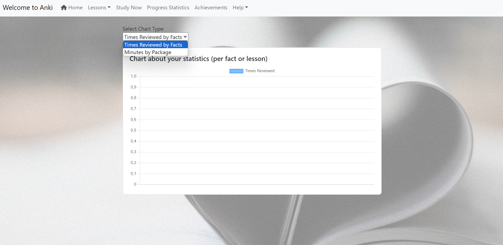

## Help/Glossary
Learn about key terms you may encounter while reading lessons.
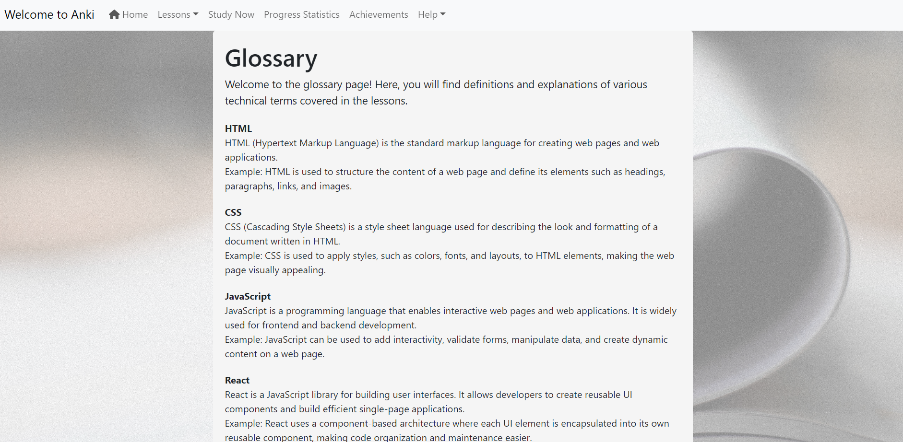

## Help/Documentation
Refer to the documentation for basic instructions on how to navigate and use the app.
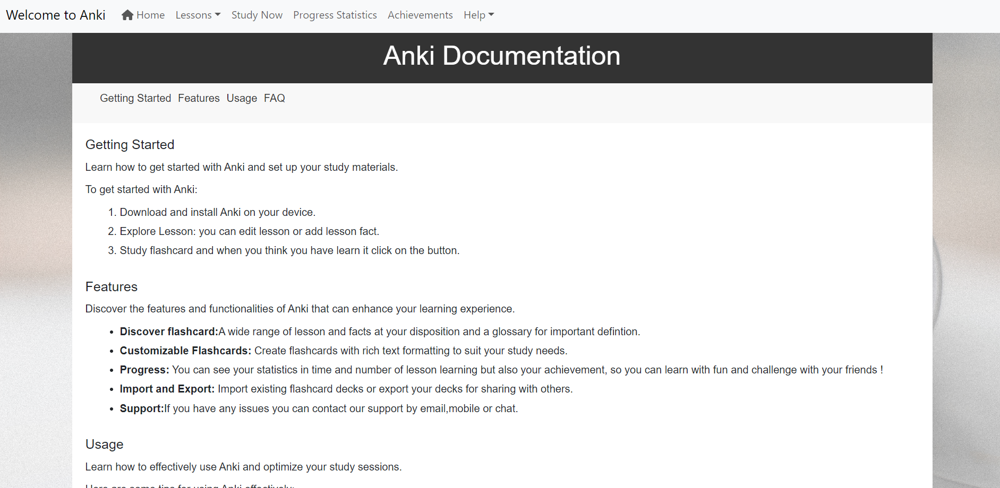

## Help/Contact Us
Have additional questions? Reach out to us on the contact page. (! NOT WORKING !)
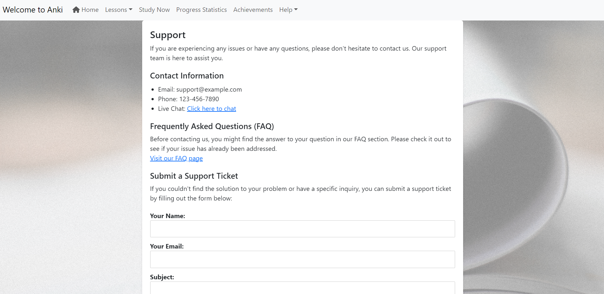
